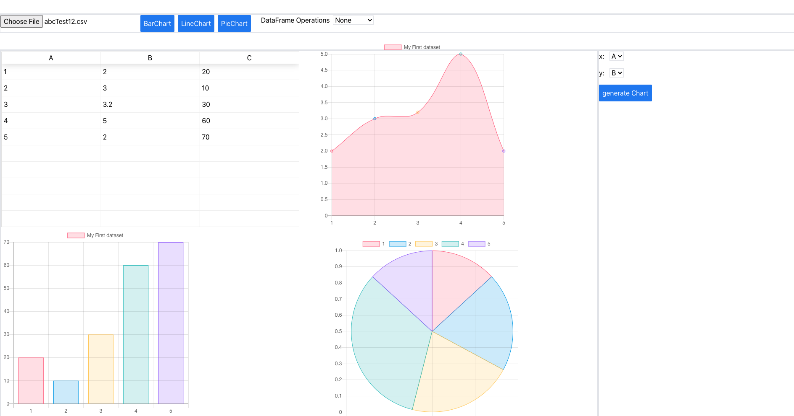

# No Code Data Platform

Enabling data visualisation and Analysis/Proccessing visually like an Artist with Danfojs

Clone the repo and cd into the repo directory and then run `yarn`

This a work in progres and lack some styling. The major part of `Data-aRT` is fully implemented here is what it looks like (in simple wireframe design):

