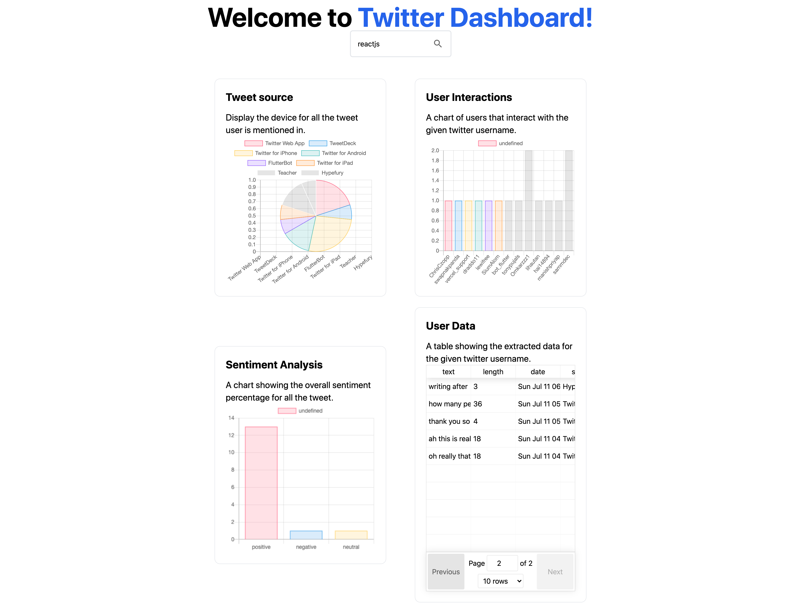

# Simple Twitter DashBoard

This dashboard contains basice tweet analytics of a given twitter username. The main purpose of the app is to show how to build an analytic app using Danfojs at the frontend and also at the Backend.

The app is built using Nextjs with Tailwind Css integration.

